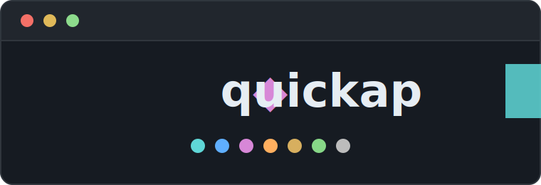

<div align="center">

<br>



<br>

**A fast CLI with zero dependencies that shows you what's in a
directory, and what's in it twice.**

*⚡ **quick**ap = **quick cap**ture. Say it "quick cap": one quick
capture of everything in a directory.*

<sub>applications · archives · documents · images · videos · music ·
everything else</sub>

[](https://github.com/jordancannon88/quickap/actions/workflows/ci.yml)
[](LICENSE)
[](https://github.com/jordancannon88/quickap/releases/latest)

**[Install](#install)** · **[Usage](#usage)** ·
**[Examples](#examples)** ·
**[How it works](#how-duplicate-detection-works)** ·
**[Wiki](https://github.com/jordancannon88/quickap/wiki)**

</div>

<table>
  <tr>
    <td>🔍 <b>Index</b></td>
    <td>Seven file categories in one recursive scan, with totals and stats for every extension in a clean, colorful terminal UI.</td>
  </tr>
  <tr>
    <td>👯 <b>Find duplicates</b></td>
    <td>By content (SHA&#8209;256). A renamed copy, or one saved under a different extension, is still a copy.</td>
  </tr>
  <tr>
    <td>🧹 <b>Clean up</b></td>
    <td>List duplicates, move them out for manual sorting, or delete them. Each group's original is always kept.</td>
  </tr>
  <tr>
    <td>📦 <b>Single binary</b></td>
    <td>No runtime, no config, no dependencies. Linux, BSD, macOS, Windows.</td>
  </tr>
</table>

> [!NOTE]
> AI was used to help write the code in this project.

## At a glance

`quickap` with no arguments gives a compact overview of every category:


A category command — here `quickap videos` — gives the detailed view: a
summary, a reclaimable-space meter, and a per-extension breakdown with
two-tone bars (cyan unique, yellow duplicate):


*Both images are real program output, rendered to SVG by
[`assets/ansi2svg.py`](assets/ansi2svg.py) — what you see is exactly
what the tool prints.*

## Install

### Download a release

Grab the binary for your platform from the
[latest release](https://github.com/jordancannon88/quickap/releases/latest)
and put it on your `PATH`:

```sh
# example: Linux x86-64
curl -sLo quickap https://github.com/jordancannon88/quickap/releases/latest/download/quickap-linux-amd64
chmod +x quickap
mv quickap ~/.local/bin/
```

| Platform | Assets |
| -------- | ------ |
| Linux    | `quickap-linux-amd64` · `quickap-linux-arm64` |
| macOS    | `quickap-darwin-arm64` (Apple Silicon) · `quickap-darwin-amd64` (Intel) |
| BSD      | `quickap-{freebsd,openbsd,netbsd,dragonfly}-amd64` · `quickap-freebsd-arm64` |
| Windows  | `quickap-windows-amd64.exe` |
| Any      | `quickap.1` (manual page) |

macOS note: browser downloads get quarantined by Gatekeeper — clear it
with `xattr -d com.apple.quarantine ./quickap`.

<details>
<summary><strong>Verify your download</strong> (SHA-256 + cosign)</summary>

Every release includes a `checksums.txt` with the SHA-256 of every
asset:

```sh
curl -sLO https://github.com/jordancannon88/quickap/releases/latest/download/checksums.txt
sha256sum -c checksums.txt --ignore-missing   # macOS: shasum -a 256 -c
```

The checksums file itself is signed keylessly with
[cosign](https://docs.sigstore.dev/) by the release workflow's GitHub
OIDC identity — verifying the signature proves it was produced by this
repository's release workflow:

```sh
base=https://github.com/jordancannon88/quickap/releases/latest/download
curl -sLO $base/checksums.txt.sig
curl -sLO $base/checksums.txt.pem
cosign verify-blob \
  --certificate checksums.txt.pem \
  --signature checksums.txt.sig \
  --certificate-identity-regexp 'https://github\.com/jordancannon88/quickap/\.github/workflows/release\.yml@refs/tags/v.*' \
  --certificate-oidc-issuer https://token.actions.githubusercontent.com \
  checksums.txt
```

</details>

### Build locally

Requires Go 1.26+. No external dependencies, no cgo — cross-compile
with plain `GOOS`/`GOARCH`.

```sh
git clone https://github.com/jordancannon88/quickap.git
cd quickap
go test ./...
go build -o quickap .
cp quickap ~/.local/bin/
```

### Man page

The manual page [`quickap.1`](quickap.1) documents every command, flag,
and behavior in full — it's at the repository root and attached to each
release. Install it so `man quickap` works anywhere:

```sh
install -Dm644 quickap.1 ~/.local/share/man/man1/quickap.1        # per-user
sudo install -Dm644 quickap.1 /usr/local/share/man/man1/quickap.1 # system-wide
```

Or preview it without installing: `man ./quickap.1`.

## Usage

```sh
quickap [command] [flags] [directory]
```

The directory to scan defaults to the current one; pass a different one
as the **last** argument, after any flags. Relative `-move` and
`-ignore` paths resolve against the scanned directory.

### Commands

| Command      | Description |
| ------------ | ----------- |
| *(none)*     | Index all categories, compact overview. |
| `apps`       | Index applications only (aliases: `app`, `applications`). |
| `archives`   | Index archives only (alias: `archive`). |
| `docs`       | Index documents only (alias: `documents`). |
| `images`     | Index images only. |
| `videos`     | Index videos only (alias: `video`). |
| `music`      | Index music only. |
| `other`      | Index files no other category claims (alias: `others`). |
| `help [cmd]` | Show help, or help for one command. |
| `version`    | Print the version. |

### Flags

Every command accepts these:

| Flag | Description |
| ---- | ----------- |
| `-list-duplicates`, `-ld` | List each duplicate group; the kept original is marked `✓`, copies `✗`. |
| `-list-unique`, `-lu`     | List every file that is not a duplicate copy, with sizes. |
| `-list-large`, `-ll`      | List the 50 largest files, largest first. |
| `-ignore DIR`             | Skip a directory: a bare name (`node_modules`) matches anywhere, a path (`files/cache`) only that location. Repeat or comma-separate for multiple. |
| `-hidden`                 | Include hidden directories (`.foo/`); skipped by default. |
| `-no-cache`               | Disable the hash cache for this run. |
| `-verify`                 | Re-hash every duplicate candidate, ignoring cached hashes. |
| `-clear-cache`            | Delete the hash cache and exit. |
| `-spacious`               | Add vertical space between table rows; default is compact. |
| `-verbose`, `-vv`         | Show scan timing, hash-cache stats, and hints. |
| `-version`                | Print the version and exit. |
| `-help`                   | Show help for the current command. |

The cleanup flags act on one category at a time, so they **require a
category command** (e.g. `quickap images -delete`):

| Flag | Description |
| ---- | ----------- |
| `-move DIR` | Move each duplicate group — **original and copies** — into `DIR/<category>/group-NNN/` for manual side-by-side sorting. `DIR` is created if needed. |
| `-delete`   | **Permanently delete** duplicate files, keeping each group's original. No undo. Cannot be combined with `-move`. |

Full flag semantics, file locations, and exit statuses are in
`man quickap` and `quickap help <cmd>`.

## Examples

**Get the lay of the land.** Overview first, then drill into the
category that looks bloated:

```sh
quickap ~/Pictures                    # all categories, compact table
quickap images ~/Pictures             # per-extension detail for images
quickap images -verbose ~/Pictures    # ... plus scan timing and cache stats
```

**Clean up carefully.** Review what would be touched, then move groups
out for side-by-side sorting:

```sh
quickap images -list-duplicates        # see every duplicate group; ✓ = kept
quickap images -move ../photo-dupes    # writes to ../photo-dupes/images/group-001/ etc.
```

**Clean up decisively.** When you trust the byte-identical guarantee
and just want the space back:

```sh
quickap videos -ld         # one last look (-ld = -list-duplicates)
quickap videos -delete     # remove duplicates, keep each group's original
```

**Scope the scan.** Skip directories by name or path, or opt into
hidden ones:

```sh
quickap -ignore node_modules,dist      # skip every dir with those names
quickap docs -ignore files/archive     # skip only that path
quickap images -hidden -ignore .git    # scan hidden dirs, but not .git
```

**Force a fresh look.** If you suspect files changed without their
size/mtime changing, or want to time a cold scan:

```sh
quickap -verify        # re-hash everything, refresh the cache
quickap -no-cache -vv  # ignore the cache entirely, show timing
```

Flags stack freely on any command:
`quickap docs -hidden -ld -move ../dupes -verbose`.

## How duplicate detection works

- **Duplicates are byte-identical files** (SHA-256), regardless of
  filename or extension — `movie.mp4` and `movie-copy.mkv` with the same
  bytes are caught; re-encoded or resized lookalikes are *not* flagged.
- Files are grouped by byte size first; only same-size candidates are
  hashed (in parallel across CPU cores), so unique-sized files are never
  read and scans stay fast on large trees.
- Duplicates are detected within each category independently. Within a
  group, the lexically first path counts as the original; a group of 3
  identical files is 1 original + 2 duplicates. `-list-duplicates` shows
  exactly which file each group keeps — review it before `-delete`.
- **Hashes are cached between runs** and reused while a file's size and
  mtime are unchanged, so repeat scans only read new or modified files.
  Run with `-vv` to see the split (`12 hashed, 240 from cache`).

### The hash cache

| Platform | Location |
| -------- | -------- |
| Linux    | `~/.cache/quickap/` (or `$XDG_CACHE_HOME/quickap/`) |
| macOS    | `~/Library/Caches/quickap/` |
| Windows  | `%LocalAppData%\quickap\` |

All scans share a single `hashes.json` keyed by absolute file path, so
hashing a parent directory also warms the cache for its subdirectories.
Nothing is ever written into the scanned directories. Housekeeping is
automatic — stale entries are pruned, and a missing or corrupt cache
just means the next run re-hashes. Deleting the cache directory is
always safe; use `-verify` to force a full re-hash.

## Categories

| Category    | Extensions |
| ----------- | ---------- |
| apps        | `.apk .appimage .deb .dmg .exe .msi .pkg .rpm` |
| archives    | `.7z .7zip .bz2 .gz .iso .rar .tar .tbz .tgz .xz .zip .zst` |
| documents   | `.csv .doc .docx .epub .md .odp .ods .odt .pdf .ppt .pptx .rtf .txt .xls .xlsx` |
| images      | `.avif .bmp .gif .heic .heif .ico .jpeg .jpg .png .svg .tif .tiff .webp` |
| videos      | `.3gp .avi .flv .m4v .mkv .mov .mp4 .mpeg .mpg .ogv .webm .wmv` |
| music       | `.aac .aif .aiff .flac .m4a .mid .midi .mp3 .ogg .opus .wav .wma` |
| other files | *everything the categories above don't claim, including files with no extension* |

Extensions match case-insensitively. **Other files** is the exact
complement of the rest — `.json`, `.log`, `.go`, or no extension at all
land there — so the seven categories together always account for every
file in the scan (hidden and `-ignore`d directories aside).

## Notes

- The summary report always reflects the state **before**
  `-move`/`-delete` ran.
- `-move` keeps original filenames, suffixing collisions within a group
  (`a.jpg`, `a-2.jpg`) — detected case-insensitively so nothing is
  overwritten on macOS/Windows filesystems. A `-move` target inside the
  scanned directory will be re-indexed on the next run; use one outside
  it (e.g. `../dupes`).
- Symbolic links and other non-regular files are ignored — never
  followed, indexed, or hashed. A symlinked scan directory is resolved
  to its target first.
- Unreadable files or directories are skipped and counted, never fatal.
- Colors turn off automatically when piped, or set `NO_COLOR=1`.

## Contributing

Contributions are welcome! **Before opening a PR, please open an
[issue](https://github.com/jordancannon88/quickap/issues) first** to
discuss your idea and get feedback from maintainers.

1. Open an issue describing the bug or the feature you'd like to build.
2. Fork, branch from `dev`, make the change — standard library only,
   no new dependencies.
3. Run `go vet ./...` and `go test ./...`; keep the docs (README,
   `quickap.1`, built-in help) in sync with user-facing changes.
4. Open a PR against `dev`, linking the issue.

The full guide lives in [CONTRIBUTING.md](CONTRIBUTING.md) and on the
[Contributing wiki page](https://github.com/jordancannon88/quickap/wiki/Contributing);
the [wiki](https://github.com/jordancannon88/quickap/wiki) also covers
CI, branch protection, and the release process.

## License

[AGPL-3.0](LICENSE) — GNU Affero General Public License v3.0.
