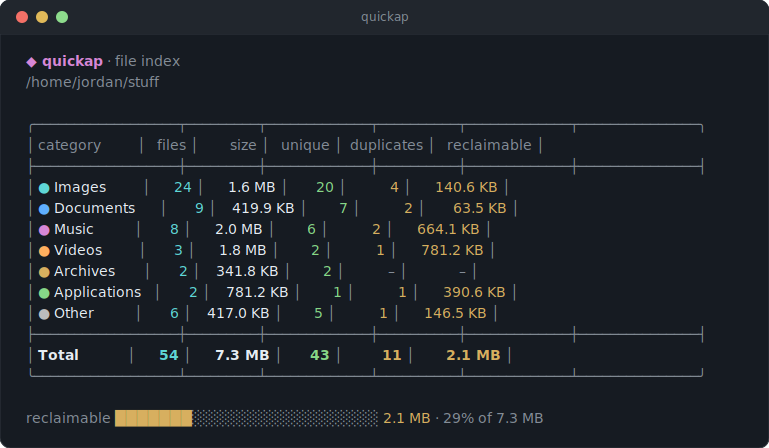
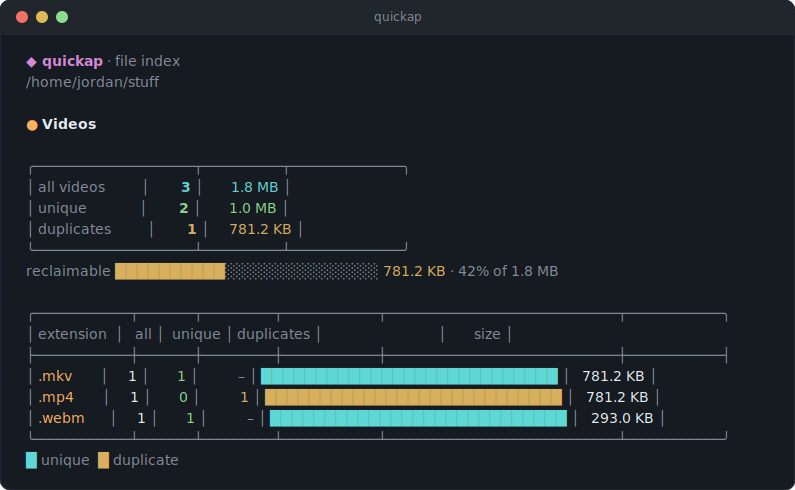

# quickap

> [!NOTE]
> AI was used to help write the code in this project.

**quickap** — pronounced *quick-cap* — takes its name from **quick
capture**: a quick capture of everything in a directory.

**A fast, zero-dependency CLI for finding out what's in a directory — and
what's in it twice.**

[](https://github.com/jordancannon88/quickap/actions/workflows/ci.yml)
[](LICENSE)
[](https://github.com/jordancannon88/quickap/releases/latest)

quickap indexes **images · documents · music · videos · archives ·
applications** under any directory and reports totals, per-extension
stats, and duplicates — in a clean, colorful terminal UI.

- 🔍 **Index** six file categories in one recursive scan
- 👯 **Find duplicates** by content (SHA-256), whatever the file is named
- 🧹 **Clean up** — list, move for manual sorting, or delete duplicates
- 📦 **Single binary** — no runtime, no config, Linux/macOS/Windows

> [!TIP]
> Beyond this README, the [project wiki](https://github.com/jordancannon88/quickap/wiki)
> covers the release process, verifying downloads, and the development
> workflow.

## At a glance

Running `quickap` with no arguments gives a compact overview of every
category:



A category command — here `quickap videos` — gives the detailed view:
a summary table, a reclaimable-space meter, and a per-extension breakdown
with two-tone bars (cyan unique, yellow duplicate):



## Features

- User-friendly, colorful output — auto-disables when piped or with `NO_COLOR`
- Six file categories: images, documents, music, videos, archives, applications
- Compact all-categories overview, or detailed per-extension reports with
  two-tone unique/duplicate bars
- Duplicate detection by content (SHA-256) — catches renamed and
  re-extensioned copies, never false-flags same-size files
- Hash cache: repeat scans only read new or modified files
- Clean up duplicates your way: `-list` to review, `-move` into per-group
  folders for manual sorting, or `-delete` keeping each original
- Scoped scans: point it at any directory (`quickap images ~/Pictures`),
  `-ignore` directories by name or path, opt into hidden directories
  with `-hidden`
- Single static binary for Linux, macOS, and Windows — no runtime, no
  config, no dependencies
- Signed releases: SHA-256 checksums with keyless cosign signatures

## Install

### Download a release

Prebuilt binaries for every tagged version are on the
[releases page](https://github.com/jordancannon88/quickap/releases),
built automatically by the release workflow:

| File                          | Platform                        |
| ----------------------------- | --------------------------------|
| `quickap-linux-amd64`         | Linux, x86-64                   |
| `quickap-linux-arm64`         | Linux, ARM64                    |
| `quickap-darwin-arm64`        | macOS, Apple Silicon (M-series) |
| `quickap-darwin-amd64`        | macOS, Intel                    |
| `quickap-windows-amd64.exe`   | Windows, x86-64                 |

Each release also includes a `checksums.txt` with the SHA-256 of every
binary, signed keylessly with [cosign](https://docs.sigstore.dev/)
(`checksums.txt.sig` + `checksums.txt.pem`) by the release workflow's
GitHub OIDC identity.

```sh
# example: Linux x86-64
curl -sLo quickap https://github.com/jordancannon88/quickap/releases/latest/download/quickap-linux-amd64
chmod +x quickap
mv quickap ~/.local/bin/   # or anywhere on your PATH
```

To verify a download:

```sh
curl -sLO https://github.com/jordancannon88/quickap/releases/latest/download/checksums.txt
sha256sum -c checksums.txt --ignore-missing   # macOS: shasum -a 256 -c
```

To additionally verify the checksums file is authentic (requires
[cosign](https://docs.sigstore.dev/cosign/system_config/installation/)):

```sh
base=https://github.com/jordancannon88/quickap/releases/latest/download
curl -sLO $base/checksums.txt.sig
curl -sLO $base/checksums.txt.pem
cosign verify-blob \
  --certificate checksums.txt.pem \
  --signature checksums.txt.sig \
  --certificate-identity-regexp 'https://github\.com/jordancannon88/quickap/\.github/workflows/release\.yml@refs/tags/v.*' \
  --certificate-oidc-issuer https://token.actions.githubusercontent.com \
  checksums.txt
```

This proves the checksums file was produced by this repository's release
workflow, not by someone who merely obtained upload access.

macOS note: binaries downloaded via browser get quarantined by Gatekeeper —
clear it with `xattr -d com.apple.quarantine ./quickap`. The binaries are
unsigned; build locally if you prefer.

### Build locally

Requires Go 1.26+. No external dependencies, no cgo.

```sh
git clone https://github.com/jordancannon88/quickap.git
cd quickap
go test ./...              # run the tests
go build -o quickap .      # build for this machine
cp quickap ~/.local/bin/   # or anywhere on your PATH
```

Cross-compile by setting the target platform, e.g.:

```sh
GOOS=darwin GOARCH=arm64 go build -o quickap-darwin-arm64 .
GOOS=windows GOARCH=amd64 go build -o quickap-windows-amd64.exe .
```

### CI & releases

GitHub Actions runs vet, tests, and a build on every push and pull request
(`.github/workflows/ci.yml`). Pushing a tag matching `v*` (e.g. `v1.0.0`)
runs the release workflow (`.github/workflows/release.yml`), which builds
the five platform binaries above and publishes them as a GitHub release
with a per-commit changelog and a cosign-signed `checksums.txt` of
SHA-256 sums.

## Usage

```sh
quickap [command] [flags] [directory]

quickap                   # overview of all categories, current directory
quickap ~/Pictures        # ... of another directory
quickap images            # detailed image report
quickap images ~/Pictures # ... for another directory
quickap docs -list        # document report + duplicate groups
quickap music -move DIR   # move music duplicate groups into DIR for sorting
quickap videos -delete    # delete video duplicates, keeping originals
quickap -ignore dist      # skip every dir named "dist" (repeatable, or a,b,c)
quickap -hidden           # include hidden directories in the scan
quickap help              # full help, including per-command flags
quickap help docs         # help for one command (also: quickap docs -help)
quickap version           # print version (also: -version)
```

The directory to scan defaults to the current one; pass a different one as
the **last** argument (after any flags). Relative `-move` and `-ignore`
paths resolve against the scanned directory.

### Commands

| Command      | Description                                          |
| ------------ | -----------------------------------------------------|
| *(none)*     | Index all categories, compact overview.              |
| `images`     | Index images only.                                   |
| `docs`       | Index documents only (alias: `documents`).           |
| `music`      | Index music only.                                    |
| `videos`     | Index videos only (alias: `video`).                  |
| `archives`   | Index archives only (alias: `archive`).              |
| `apps`       | Index applications only (aliases: `app`, `applications`). |
| `help [cmd]` | Show help, or help for one command.                  |
| `version`    | Print the version.                                   |

### Flags

Flags operate on the current command's category. The modifying flags `-move`
and `-delete` act on one category at a time, so they **require a category
command**; the bare `quickap` command indexes and reports only.
`quickap help <cmd>` shows the exact per-command flag descriptions.

| Flag        | Commands       | Description                                                                                                                 |
| ----------- | -------------- | --------------------------------------------------------------------------------------------------------------------------|
| `-list`     | all            | List each duplicate group with file paths. The kept original is marked `✓`, duplicates `✗`.                                 |
| `-move DIR` | category cmds  | Move each duplicate group — **original and copies** — into `DIR/<category>/group-NNN/` for manual side-by-side sorting. `DIR` is created if needed and resolved relative to the scanned directory. |
| `-delete`   | category cmds  | **Permanently delete** duplicate files, keeping each group's original. No undo. Cannot be combined with `-move`.            |
| `-ignore DIR` | all          | Skip a directory while scanning. A bare name (`node_modules`) skips every directory with that name; a path (`files/cache`) skips that path relative to the scanned directory. Repeat the flag or comma-separate for multiple: `-ignore tunes,media -ignore dist`. |
| `-hidden`   | all            | Include hidden directories (`.foo/`) in the scan. Skipped by default.                                                       |
| `-no-cache` | all            | Disable the hash cache for this run (no reads from or writes to it).                                                        |
| `-verify`   | all            | Re-hash every duplicate candidate, ignoring cached hashes (the cache is still updated with the fresh results).              |
| `-spacious` | all            | Add vertical space between table rows for easier reading. Default is compact.                                               |
| `-verbose` / `-vv` | all     | Show scan details below the report: timing, hash-cache stats (`12 hashed, 240 from cache`), and hints. Off by default.      |
| `-version`  | all            | Print the version and exit.                                                                                                 |
| `-help`     | all            | Show help for the current command.                                                                                          |

### Examples

**Get the lay of the land.** Overview first, then drill into the category
that looks bloated:

```sh
quickap ~/Pictures                    # all categories, compact table
quickap images ~/Pictures             # per-extension detail for images
quickap images -verbose ~/Pictures    # ... plus scan timing and cache stats
```

**Clean up a photo library, carefully.** Review what would be touched
before changing anything:

```sh
quickap images -list                   # see every duplicate group; ✓ = kept
quickap images -move ../photo-dupes    # move groups out for side-by-side review
# ...inspect ../photo-dupes/images/group-001/ etc., keep what you want
```

**Clean up decisively.** When you trust the byte-identical guarantee and
just want the space back:

```sh
quickap videos -list       # one last look
quickap videos -delete     # remove duplicates, keep each group's original
```

**Scope the scan.** Skip build output and vendored code by name, a
specific folder by path, or include hidden directories:

```sh
quickap -ignore node_modules,dist      # skip every dir with those names
quickap docs -ignore files/archive     # skip only that path
quickap images -hidden -ignore .git    # scan hidden dirs, but not .git
```

**Audit a Downloads folder.** Archives and installers accumulate copies
like `setup(1).exe` — content hashing catches them regardless of name:

```sh
cd ~/Downloads
quickap archives -list
quickap apps -delete
```

**Combine freely.** Flags stack on any command:

```sh
quickap docs -hidden -list -move ../dupes -verbose
quickap music -ignore samples,loops -delete
```

**Force a fresh look.** If you suspect files changed without their
size/mtime changing, or want to time a cold scan:

```sh
quickap -verify        # re-hash everything, refresh the cache
quickap -no-cache -vv  # ignore the cache entirely, show timing
```

Note that `-move` keeps categories separate — `quickap images -move
../dupes` writes to `../dupes/images/group-001/`.

## How duplicate detection works

- Files are grouped by byte size first; only same-size candidates are hashed
  (SHA-256, in parallel across CPU cores), so unique-sized files are never
  read and scans stay fast on large trees.
- **Hashes are cached between runs** (see [The hash cache](#the-hash-cache)
  below). A cached hash is reused when the file's size and mtime are
  unchanged, so repeat scans only read new or modified files — on a
  mostly-static library, the second run drops from "read every duplicate
  candidate" to near walk speed. Run with `-verbose` (`-vv`) to see the
  split (`12 hashed, 240 from cache`) and scan timing.
- **Duplicates are byte-identical files**, regardless of filename or
  extension — the same bytes saved as `movie.mp4` and `movie-copy.mkv` are
  caught. Similar-looking but re-encoded/resized files are *not* flagged.
- Duplicates are detected within each category independently.
- Within a group, the lexically first path counts as the original; the rest
  are duplicates. The "Duplicates" count is the number of redundant copies,
  so a group of 3 identical files counts as 1 original + 2 duplicates.
  `-list` shows exactly which file each group keeps — review it before
  running `-delete`.

### The hash cache

Cached results are stored in your platform's user cache directory, under a
`quickap` folder:

| Platform | Location                                             |
| -------- | -----------------------------------------------------|
| Linux    | `~/.cache/quickap/` (or `$XDG_CACHE_HOME/quickap/`)  |
| macOS    | `~/Library/Caches/quickap/`                          |
| Windows  | `%LocalAppData%\quickap\`                            |

All scans share a single `hashes.json`, a JSON map of `path → {size,
mtime, sha256}` keyed by absolute file path for every file that has been
content-hashed. Because entries are path-keyed rather than
per-scan-directory, hashes carry across scan roots — scan a parent
directory once and later scans of any subdirectory reuse its hashes
instead of re-reading the files. Nothing is ever written into the scanned
directories themselves.

Cache housekeeping is automatic: entries for files deleted under the
scanned directory are pruned on each run (entries from other trees are
left alone), and a missing or corrupt cache file just means the next run
re-hashes everything. It's always safe to delete the cache directory —
that's equivalent to a one-time `-no-cache` run. Use `-verify` to force a
full re-hash if you suspect a file changed without its size or mtime
changing.

## Categories

| Category     | Extensions                                                              |
| ------------ | ------------------------------------------------------------------------|
| images       | `.avif .bmp .gif .heic .heif .ico .jpeg .jpg .png .svg .tif .tiff .webp` |
| documents    | `.csv .doc .docx .epub .md .odp .ods .odt .pdf .ppt .pptx .rtf .txt .xls .xlsx` |
| music        | `.aac .aif .aiff .flac .m4a .mid .midi .mp3 .ogg .opus .wav .wma`       |
| videos       | `.3gp .avi .flv .m4v .mkv .mov .mp4 .mpeg .mpg .ogv .webm .wmv`         |
| archives     | `.7z .7zip .bz2 .gz .iso .rar .tar .tbz .tgz .xz .zip .zst`             |
| apps         | `.apk .appimage .deb .dmg .exe .msi .pkg .rpm`                          |

Extensions are matched case-insensitively.

## Notes

- The scan is recursive from the scanned directory (current directory by
  default, or the one passed as the last argument).
- The summary report always reflects the state **before** `-move`/`-delete`.
- `-move` keeps original filenames, suffixing collisions within a group
  (`a.jpg`, `a-2.jpg`), and falls back to copy+delete across filesystems.
  Collisions are detected case-insensitively (`Photo.JPG` vs `photo.jpg`)
  so nothing is overwritten on case-insensitive filesystems (macOS APFS,
  Windows).
- A `-move` target inside the current directory will be re-indexed on the
  next run; use a target outside it (e.g. `../dupes`) to avoid that.
- Unreadable files or directories are skipped and counted in the footer,
  never fatal.
- Colors turn off automatically when output is piped, or set `NO_COLOR=1`.

## License

[AGPL-3.0](LICENSE) — GNU Affero General Public License v3.0.
